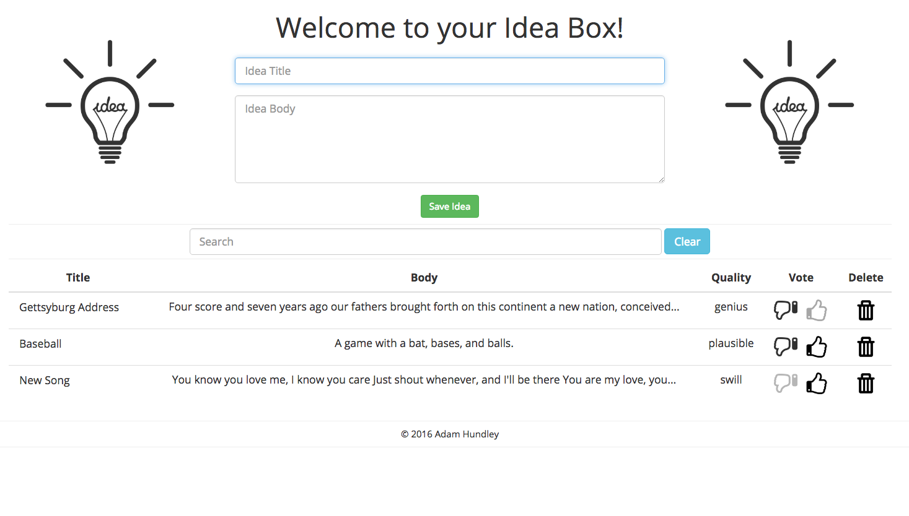

# Revenge of Idea Box
 
### Overview

This is a Rails, single-page application. It uses JavaScript and jQuery to set up CRUD functionality for creating and storing ideas. The app relies on jQuery's AJAX methods to make calls internal API endpoints to get, store, update, and delete data. This project stretched my knowledge and use of all client side code and pushed me to get away from the comfort of constant page refreshes.

### Production

[Idea Lightbulb](https://idea-lightbulb.herokuapp.com)

### Screenshot

### Test Suite

The test suite can be run locally using Rspec and the `rspec` command. JavaScript functions tests can be run using Teaspoon and the `bundle exec rake teaspoon` command.
